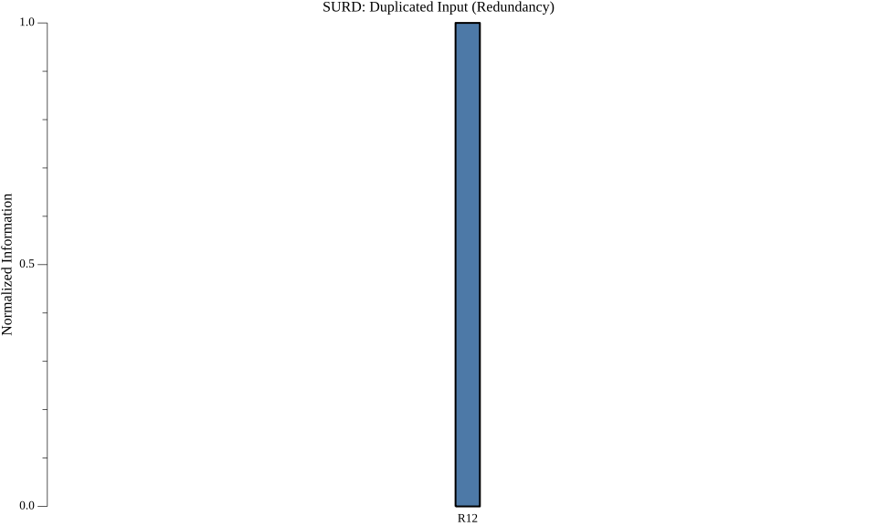
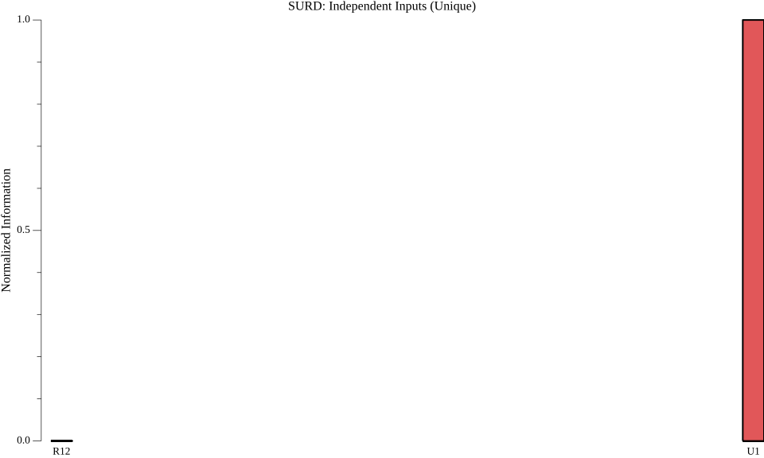
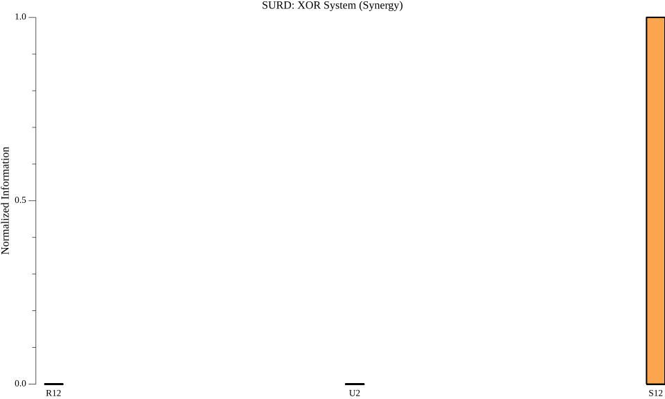

# CausalGo: High-Performance Causal Discovery in Go

[](https://pkg.go.dev/github.com/causalgo/causalgo)
[](https://opensource.org/licenses/MIT)
[](https://github.com/causalgo/causalgo/actions/workflows/go.yml)
[](https://goreportcard.com/report/github.com/causalgo/causalgo)

**CausalGo** is a high-performance library for causal discovery in Go. It provides multiple algorithms for inferring causal relationships from observational data.

## Algorithms

| Algorithm | Status | Description |
|-----------|--------|-------------|
| **VarSelect** | Implemented | LASSO-based recursive variable selection for causal ordering |
| **SURD** | In Development | Synergistic-Unique-Redundant Decomposition ([Nature Communications 2024](https://doi.org/10.1038/s41467-024-53373-4)) |

## Key Features

- High-performance parallel processing
- Memory-efficient handling of large datasets
- Full Gonum integration for scientific computing
- Plugin architecture for custom regression models
- Comprehensive tests & benchmarks

## Installation

```bash
go get github.com/causalgo/causalgo
```

## Quick Start (VarSelect)

```go
package main

import (
    "fmt"
    "log"
    "math/rand"

    "github.com/causalgo/causalgo/internal/varselect"
    "gonum.org/v1/gonum/mat"
)

func main() {
    // Create synthetic data (100 samples, 3 variables)
    data := mat.NewDense(100, 3, nil)
    for i := 0; i < 100; i++ {
        x := rand.Float64()
        data.Set(i, 0, x)
        data.Set(i, 1, x*0.8+rand.Float64()*0.2)
        data.Set(i, 2, x*0.5+data.At(i, 1)*0.5+rand.Float64()*0.1)
    }

    // Configure algorithm
    config := varselect.Config{
        Lambda:    0.1,    // LASSO regularization
        Tolerance: 1e-5,   // Convergence threshold
        MaxIter:   1000,   // Maximum iterations
        Workers:   4,      // Parallel workers
    }

    // Run variable selection
    selector := varselect.New(config)
    result, err := selector.Fit(data)
    if err != nil {
        log.Fatalf("Fit error: %v", err)
    }

    fmt.Println("Causal Order:", result.Order)
    fmt.Println("Residual Variances:", result.Residuals)
}
```

## SURD Algorithm

SURD (Synergistic-Unique-Redundant Decomposition) is an information-theoretic approach to causal discovery that decomposes causality into:

- **Redundant (R)**: Common causality shared among multiple variables
- **Unique (U)**: Causality from one variable that can't be obtained from others
- **Synergistic (S)**: Causality from joint effect of multiple variables
- **Information Leak**: Causality from unobserved variables

### Basic Usage

```go
package main

import (
    "fmt"
    "github.com/causalgo/causalgo/surd"
    "github.com/causalgo/causalgo/pkg/visualization"
)

func main() {
    // Your time series data: [samples x variables]
    // First column is target (Q+), rest are agents
    data := [][]float64{
        {1.0, 0.5, 0.3},  // sample 0
        {2.0, 1.5, 0.7},  // sample 1
        // ...
    }

    bins := []int{10, 10, 10}  // Number of bins for each variable

    result, err := surd.DecomposeFromData(data, bins)
    if err != nil {
        panic(err)
    }

    // Access results
    fmt.Printf("Unique causality: %+v\n", result.Unique)
    fmt.Printf("Redundant causality: %+v\n", result.Redundant)
    fmt.Printf("Synergistic causality: %+v\n", result.Synergistic)
    fmt.Printf("Information leak: %.4f\n", result.InfoLeak)

    // Visualize results
    opts := visualization.DefaultPlotOptions()
    plot, _ := visualization.PlotSURD(result, opts)
    visualization.SavePNG(plot, "surd_result.png", 10, 6)
}
```

### Visualization

Generate plots from command line:

```bash
# Basic usage (ASCII chart only)
go run cmd/visualize/main.go --system xor

# With PNG output
go run cmd/visualize/main.go --system xor --output surd_xor.png

# With SVG output
go run cmd/visualize/main.go --system xor --output surd_xor.svg --format svg
```

See [pkg/visualization/README.md](pkg/visualization/README.md) for detailed visualization documentation.

### Example Plots

<table>
<tr>
<td><br/><b>Redundancy</b> (Duplicated Input)</td>
<td><br/><b>Unique</b> (Independent Inputs)</td>
<td><br/><b>Synergy</b> (XOR System)</td>
</tr>
</table>

## System Requirements

- **Go 1.24+**
- Linux/macOS/Windows
- 4+ CPU cores recommended

## Packages

- **surd**: SURD algorithm implementation
- **pkg/visualization**: Plotting and visualization utilities (PNG/SVG/PDF export)
- **internal/varselect**: Variable selection algorithm
- **internal/entropy**: Information theory functions (entropy, mutual information)
- **internal/histogram**: N-dimensional histogram utilities
- **regression**: Regression interfaces and LASSO implementations
  - `NewLASSO` — Built-in simple LASSO
  - `NewExternalLASSO` — Adapter for [CausalGo/lasso](https://github.com/causalgo/lasso) (parallel, full-featured)

## Testing

```bash
go test -v ./...
go test -bench=. ./...
```

## Contributing

1. Fork the repository
2. Create a feature branch
3. Commit your changes
4. Push to the branch
5. Create a Pull Request

## License

MIT License. See [LICENSE](LICENSE) for details.

## Citation

If using the SURD algorithm, please cite:

```bibtex
@article{martinez2024decomposing,
  title={Decomposing causality into its synergistic, unique, and redundant components},
  author={Mart{\'\i}nez-S{\'a}nchez, {\'A}lvaro and Arranz, Gonzalo and Lozano-Dur{\'a}n, Adri{\'a}n},
  journal={Nature Communications},
  volume={15},
  pages={9296},
  year={2024},
  doi={10.1038/s41467-024-53373-4}
}
```

## Contact

Project Maintainer: Andrey Kolkov - a.kolkov@gmail.com

Project Link: [https://github.com/causalgo/causalgo](https://github.com/causalgo/causalgo)
