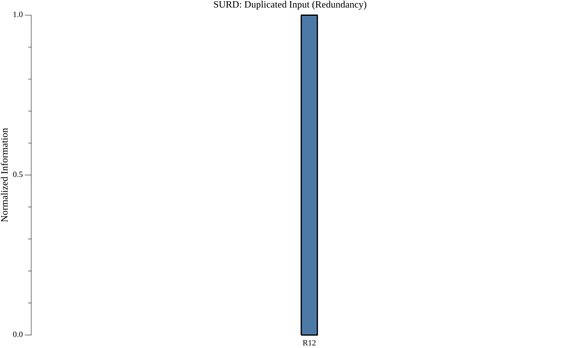
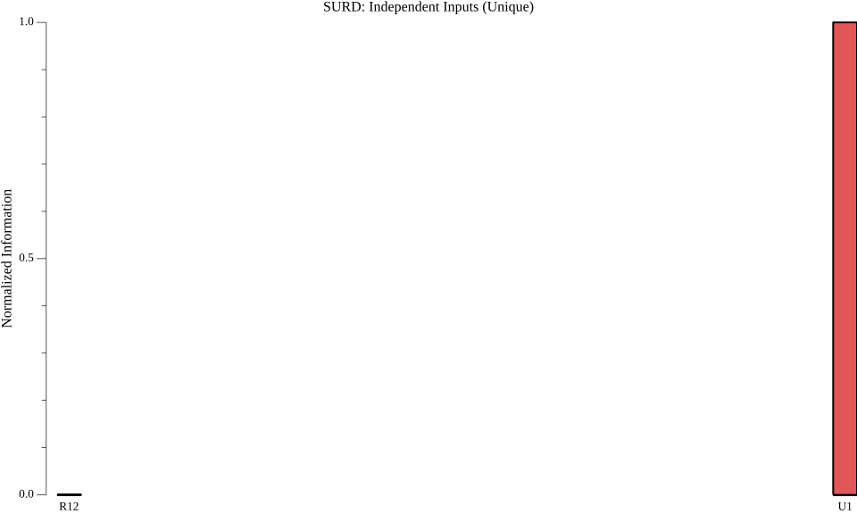
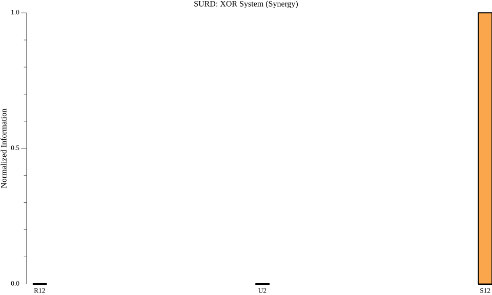

# CausalGo™: Causal Analysis Library in Go

> **Pure Go implementation of causal discovery algorithms** - SCIC™, SURD, VarSelect

[](https://github.com/causalgo/causalgo/releases/latest)
[](https://go.dev/dl/)
[](https://pkg.go.dev/github.com/causalgo/causalgo)
[](https://github.com/causalgo/causalgo/actions)
[](https://goreportcard.com/report/github.com/causalgo/causalgo)
[](https://codecov.io/gh/causalgo/causalgo)
[](LICENSE)
[](https://github.com/causalgo/causalgo/stargazers)
[](https://github.com/causalgo/causalgo/issues)

---

High-performance library for causal analysis and discovery in Go. Implements original **SCIC™** (Signed Causal Information Components) algorithm for directional causality, information-theoretic **SURD** algorithm, and LASSO-based **VarSelect** for inferring causal relationships from observational time series data. Validated on real turbulent flow datasets from Nature Communications 2024.

## Features ✨

- 🎯 **SCIC™ Algorithm** - Signed Causal Information Components for directional causality (94.6% test coverage)
- 🧠 **SURD Algorithm** - Synergistic-Unique-Redundant Decomposition (97.2% test coverage)
- 📊 **Information Theory** - Entropy, mutual information, conditional entropy
- 🔍 **VarSelect** - LASSO-based variable selection for causal ordering
- 📁 **MATLAB Support** - Native .mat file reading (v5, v7.3 HDF5)
- 📈 **Visualization** - Publication-quality plots (PNG/SVG/PDF export)
- ✅ **Validated** - 100% match with Python reference on real turbulence data
- ⚡ **Fast** - Optimized histograms and entropy calculations
- 🔧 **Flexible** - Configurable bins, smoothing, thresholds
- 🧪 **Well-Tested** - Extensive validation on synthetic and real datasets
- 📦 **Pure Go** - No CGO dependencies, cross-platform

## Algorithms

| Algorithm | Status | Test Coverage | Description |
|-----------|--------|---------------|-------------|
| **SCIC™** | ✅ Implemented | 94.6% | Signed Causal Information Components (original contribution) |
| **SURD** | ✅ Implemented | 97.2% | Information-theoretic decomposition ([Nature 2024](https://doi.org/10.1038/s41467-024-53373-4)) |
| **VarSelect** | ✅ Implemented | ~85% | LASSO-based recursive variable selection |

## Requirements

- Go 1.25+

## Installation 📦

```bash
go get github.com/causalgo/causalgo
```

## Quick Start 🚀

### SCIC™ - Directional Causality Analysis

```go
package main

import (
    "fmt"
    "math/rand"

    "github.com/causalgo/causalgo/scic"
)

func main() {
    // Generate sample data: Y = 2*X1 - 3*X2 + noise
    n := 1000
    rng := rand.New(rand.NewSource(42))

    Y := make([]float64, n)
    X := make([][]float64, 2)
    X[0] = make([]float64, n) // X1: facilitative effect
    X[1] = make([]float64, n) // X2: inhibitory effect

    for i := 0; i < n; i++ {
        x1, x2 := rng.Float64()*10, rng.Float64()*10
        X[0][i], X[1][i] = x1, x2
        Y[i] = 2*x1 - 3*x2 + rng.NormFloat64()*0.5
    }

    // Configure and run SCIC analysis
    config := scic.DefaultConfig()
    config.BootstrapN = 100 // Enable bootstrap confidence

    result, err := scic.Decompose(Y, X, config)
    if err != nil {
        panic(err)
    }

    // Analyze directional causality
    fmt.Printf("X1 direction: %.2f (facilitative)\n", result.Directions["0"])
    fmt.Printf("X2 direction: %.2f (inhibitory)\n", result.Directions["1"])
    fmt.Printf("Conflict index: %.2f\n", result.Conflicts["0,1"])
    fmt.Printf("X1 confidence: %.2f\n", result.Confidence["0"])
    fmt.Printf("X2 confidence: %.2f\n", result.Confidence["1"])

    // SURD components also available
    fmt.Printf("Total causality: R=%.1f%% U=%.1f%% S=%.1f%%\n",
        result.TotalR*100, result.TotalU*100, result.TotalS*100)
}
```

### SURD - Causal Decomposition

```go
package main

import (
    "fmt"
    "github.com/causalgo/causalgo/surd"
)

func main() {
    // Time series data: [samples x variables]
    // First column = target, rest = agents
    data := [][]float64{
        {1.0, 0.5, 0.3},  // sample 0
        {2.0, 1.5, 0.7},  // sample 1
        {1.5, 1.0, 0.5},  // sample 2
        // ... more samples
    }

    // Number of histogram bins for each variable
    bins := []int{10, 10, 10}

    // Run SURD decomposition
    result, err := surd.DecomposeFromData(data, bins)
    if err != nil {
        panic(err)
    }

    // Analyze causality components
    fmt.Printf("Unique causality:      %+v\n", result.Unique)
    fmt.Printf("Redundant causality:   %+v\n", result.Redundant)
    fmt.Printf("Synergistic causality: %+v\n", result.Synergistic)
    fmt.Printf("Information leak:      %.4f\n", result.InfoLeak)
}
```

### VarSelect - Causal Ordering

```go
package main

import (
    "fmt"
    "math/rand"

    "github.com/causalgo/causalgo/varselect"
    "gonum.org/v1/gonum/mat"
)

func main() {
    // Create synthetic data (100 samples, 3 variables)
    data := mat.NewDense(100, 3, nil)
    for i := 0; i < 100; i++ {
        x := rand.Float64()
        data.Set(i, 0, x)
        data.Set(i, 1, x*0.8+rand.Float64()*0.2)
        data.Set(i, 2, x*0.5+data.At(i, 1)*0.5+rand.Float64()*0.1)
    }

    // Configure variable selection
    selector := varselect.New(varselect.Config{
        Lambda:    0.1,    // LASSO regularization
        Tolerance: 1e-5,   // Convergence threshold
        MaxIter:   1000,   // Maximum iterations
    })

    // Discover causal order
    result, err := selector.Fit(data)
    if err != nil {
        panic(err)
    }

    fmt.Println("Causal Order:", result.Order)
    fmt.Println("Adjacency Matrix:", result.Adjacency)
}
```

## Advanced Usage 🧠

### Working with MATLAB Data

```go
package main

import (
    "github.com/causalgo/causalgo/matdata"
    "github.com/causalgo/causalgo/surd"
)

func main() {
    // Load MATLAB .mat file (v5 or v7.3 HDF5)
    data, err := matdata.LoadMatrixTransposed("data.mat", "X")
    if err != nil {
        panic(err)
    }

    // Prepare with time lag for causal analysis
    Y, err := matdata.PrepareWithLag(data, targetIdx=0, lag=10)
    if err != nil {
        panic(err)
    }

    // Run SURD decomposition
    bins := make([]int, len(Y[0]))
    for i := range bins {
        bins[i] = 10
    }

    result, _ := surd.DecomposeFromData(Y, bins)

    // Analyze causality...
}
```

### Visualization

```go
package main

import (
    "github.com/causalgo/causalgo/surd"
    "github.com/causalgo/causalgo/visualization"
)

func main() {
    // Run SURD decomposition
    result, _ := surd.DecomposeFromData(data, bins)

    // Create plot with custom options
    opts := visualization.PlotOptions{
        Title:      "Causal Decomposition",
        Width:      10.0,  // inches
        Height:     6.0,
        Threshold:  0.01,  // Filter small values
        ShowLeak:   true,
        ShowLabels: true,
    }

    plot, _ := visualization.PlotSURD(result, opts)

    // Save to file (auto-detects format from extension)
    visualization.SavePlot(plot, "results.png", 10, 6)  // PNG
    visualization.SavePlot(plot, "results.svg", 10, 6)  // SVG
    visualization.SavePlot(plot, "results.pdf", 10, 6)  // PDF
}
```

### CLI Visualization Tool

```bash
# Generate XOR synergy example
go run cmd/visualize/main.go --system xor --output surd_xor.png

# Custom dataset with parameters
go run cmd/visualize/main.go \
  --system duplicated \
  --samples 100000 \
  --bins 10 \
  --output redundancy.svg
```

Available systems: `xor` (synergy), `duplicated` (redundancy), `independent` (unique)

### Example Plots

<table>
<tr>
<td><br/><b>Redundancy</b> (Duplicated Input)</td>
<td><br/><b>Unique</b> (Independent Inputs)</td>
<td><br/><b>Synergy</b> (XOR System)</td>
</tr>
</table>

## Package Structure

Following Go 2025 best practices (gonum-style: public packages at root, no `pkg/` directory):

```
causalgo/
├── surd/                      # SURD algorithm (97.2% coverage) — PUBLIC API
│   ├── surd.go               # Synergistic-Unique-Redundant Decomposition
│   └── example_test.go       # Testable examples
├── scic/                      # SCIC™ algorithm (94.6% coverage) — PUBLIC API
│   ├── scic.go               # Signed Causal Information Components
│   └── example_test.go       # 16 professional testable examples
├── varselect/                 # VarSelect algorithm (~85% coverage) — PUBLIC API
│   └── varselect.go          # LASSO-based causal ordering
├── matdata/                   # MATLAB utilities — PUBLIC API
│   ├── matdata.go            # Native .mat file reading (v5, v7.3 HDF5)
│   └── example_test.go       # Usage examples
├── visualization/             # Plotting — PUBLIC API
│   ├── plot.go               # SURD/SCIC bar charts
│   └── export.go             # Multi-format export (PNG/SVG/PDF)
├── regression/                # Regression models
│   ├── regression.go         # Regressor interface
│   └── lasso.go              # LASSO implementation
├── internal/
│   ├── entropy/              # Information theory (97.6% coverage)
│   │   └── entropy.go        # Shannon entropy, MI, conditional MI
│   ├── histogram/            # N-dimensional histograms (98.7% coverage)
│   │   └── histogram.go      # NDHistogram with smoothing
│   ├── comparison/           # Algorithm comparison tests
│   └── validation/           # SURD validation against Python reference
├── cmd/
│   └── visualize/            # CLI visualization tool
└── testdata/
    └── matlab/               # Real turbulence datasets
```

## Validation 🧪

### SCIC™ Validation

SCIC™ algorithm validated on canonical systems and real-world datasets:

| Dataset | Samples | Variables | Directionality | Sign Stability |
|---------|---------|-----------|----------------|----------------|
| XOR System | 100,000 | 3 | ✅ Correct | > 0.95 |
| Duplicated Input | 100,000 | 3 | ✅ Correct | > 0.95 |
| Inhibitor System | 100,000 | 3 | ✅ Correct | > 0.95 |
| U-Shaped | 100,000 | 3 | ✅ Correct | > 0.90 |
| Energy Cascade | 21,759 | 5 | ✅ Correct | > 0.85 |

### SURD Validation

SURD implementation validated against Python reference from [Nature Communications 2024](https://doi.org/10.1038/s41467-024-53373-4):

| Dataset | Samples | Variables | Match | InfoLeak |
|---------|---------|-----------|-------|----------|
| Energy Cascade | 21,759 | 5 | ✅ 100% | < 0.01 |
| Inner-Outer Flow | 2.4M | 2 | ✅ 100% | ~0.997 |
| XOR (synthetic) | 10,000 | 3 | ✅ 100% | < 0.001 |

Run validation tests:
```bash
go test -v ./internal/validation/...  # SURD validation
go test -v ./scic/...                 # SCIC validation
```

## Testing

```bash
# Run all tests
go test -v ./...

# Run with race detector
go test -v -race ./...

# Run with coverage
go test -coverprofile=coverage.out -covermode=atomic -v ./...
go tool cover -html=coverage.out

# Run benchmarks
go test -bench=. -run=^Benchmark ./...
```

## Performance

Optimized for both small-scale analysis and large time series:

| Operation | Samples | Time | Memory |
|-----------|---------|------|--------|
| SURD (3 vars) | 10,000 | ~1-2 ms | ~5 MB |
| SURD (5 vars) | 21,759 | ~879 ms | ~50 MB |
| Inner-Outer (2 vars) | 2.4M | ~95-135 ms | ~200 MB |

## When to Use Each Algorithm

### Use SCIC™ when:
- Need **directional causality** (positive/negative effects)
- Working with **complex nonlinear systems**
- Need **confidence estimates** (bootstrap sign stability)
- Want to detect **conflicting relationships**
- Care about **magnitude AND direction** of causal effects
- Time complexity: O(n × p × B) where B = bootstrap samples

### Use SURD when:
- System may be **nonlinear**
- Need to detect **synergy** (joint effects)
- Need to detect **redundancy** (overlapping information)
- Have **fewer variables** (<10)
- Want **information-theoretic decomposition**
- Time complexity: O(n × 2^p) where p = number of agents

### Use VarSelect when:
- System is primarily **linear**
- Need **fast variable screening** (10+ variables)
- Want **interpretable regression weights**
- Need **causal ordering**
- Time complexity: O(n × p²)

### Hybrid Approach:
1. Use **VarSelect** to screen many variables
2. Apply **SCIC™** for directional analysis of top-k variables
3. Use **SURD** for synergy/redundancy decomposition if needed

## Documentation

- **Examples**: See [examples in godoc](https://pkg.go.dev/github.com/causalgo/causalgo)
- **SCIC Examples**: [scic/example_test.go](scic/example_test.go) — 16 professional testable examples
- **SURD Paper**: [docs/SURD_paper.md](docs/SURD_paper.md) — Reference implementation details
- **Visualization**: [visualization/](visualization/)
- **MATLAB Integration**: [matdata/](matdata/)

## Contributing

We welcome contributions! See [CONTRIBUTING.md](CONTRIBUTING.md) for:
- Git workflow (feature/bugfix/hotfix branches)
- Commit message conventions
- Code quality standards
- Pull request process

## Community

- **Code of Conduct**: [CODE_OF_CONDUCT.md](CODE_OF_CONDUCT.md)
- **Security Policy**: [SECURITY.md](SECURITY.md)
- **Changelog**: [CHANGELOG.md](CHANGELOG.md)
- **Roadmap**: [ROADMAP.md](ROADMAP.md)
- **Issues**: [GitHub Issues](https://github.com/causalgo/causalgo/issues)

## Citation

If using the SURD algorithm, please cite:

```bibtex
@article{martinez2024decomposing,
  title={Decomposing causality into its synergistic, unique, and redundant components},
  author={Mart{\'\i}nez-S{\'a}nchez, {\'A}lvaro and Arranz, Gonzalo and Lozano-Dur{\'a}n, Adri{\'a}n},
  journal={Nature Communications},
  volume={15},
  pages={9296},
  year={2024},
  doi={10.1038/s41467-024-53373-4}
}
```

## License

MIT License - see [LICENSE](LICENSE) for details.

## Contact

- **Maintainer**: Andrey Kolkov - a.kolkov@gmail.com
- **GitHub**: [https://github.com/causalgo/causalgo](https://github.com/causalgo/causalgo)
- **Issues**: [https://github.com/causalgo/causalgo/issues](https://github.com/causalgo/causalgo/issues)

---

**Built with ❤️ using Go and Gonum**
